## 종합 프로젝트

**: Django REST API 서버 & Vue.js 를 활용한 영화 정보 기반 추천, 커뮤니티 서비스 구성**

> 제출일 : 2020.11.26
>
> 팀원 : 이성헌, 이혜진
>


### 1. 협업 및 분업

##### A. 협업

- 설계 및 기획

  - 개발 환경 구성
  - 추천 알고리즘 구상
  - 홈페이지 구상

  

##### B. 분업

* 프로젝트 개발 : 이성헌

  * front-end (vue)
  * back-end(django)
  * 추천 알고리즘 구현
  * 서비스 배포

  

* 프로젝트 관리 : 이혜진

  * API 활용한 데이터 수집
  * 추천 알고리즘 기획
  * 서비스 디자인
  * 발표 영상 및 프레젠테이션 제작

  

##### C. 개발 환경

##### 	a. 언어

> Python 3.7+
>
> Django 3.X
>
> Node 14.15.X 
>
> Vue.js 2.6+


##### 	b. 개발 도구

> vsCode 
>
> Chrome Browser
>
> Bootstrap Vue
>
> Vuetify


##### 	c. 협업 도구

> TaskWorld
>
> GitLab


##### 	d. 아키텍쳐

> Django REST API 서버 & Vue.js


### 2. 목표

> 유저들이 수 많은 영화 정보 속에서 원하는 것들을 손쉽게 검색할 수 있도록 다양한 필터링 기능을 제공하고자 한다.
>
> 또한, 신뢰하는 사람에게 정보를 얻는 밀레니얼 세대를 저격하여 자신과 취향이 비슷한 사람을 팔로(follow)해서 관심사가 비슷한 사람들이 좋아하는 영화들을 추천받을 수 있도록 추천 서비스를 제공하고자 한다.
>
> 유저들이 해당 영화에 대해 다른 유저들과 의견을 공유할 수 있도록 커뮤니티 서비스를 제공할 것이며, 자세한 감상평을 쓸 수 있는 'Riview'페이지뿐만 아니라, 간단하게 한줄 감상평을 쓸 수 있도록 댓글 기능도 구현하였다. 이를 통해 유저들이 해당영화에 대한 별점을 주고, 다른 유저들과 소통 할 수 있는 서비스를 제공할 것이다.


##### 	A. 서비스 구현 계획

> 서비스 대분류 : Accounts, Home, Recommend, Community


1. Accounts

   * 회원가입/ 회원정보수정/ 회원탈퇴

   * 로그인/로그아웃

   * 소셜 로그인

   * 프로필 / 팔로우 / 팔로잉 

     ```TEXT
     - 프로필 page : PlayList, 작성한 리뷰 및 댓글
     ```

     

2. Home

   * 영화 목록

     ```text
     - 영화 데이터 수집 : TMDB API 활용해서 json파일 만들기 / 네이버 검색 API통해 실시간 수집
     ```

   * 영화 검색 / 필터링

     ```text
     - 필터링 기능 : 제목검색 / 장르별, ㄱㄴㄷ순, 개봉일, 인기도, 평점 / 오름차순,내림차순
     - 페이지네이션 : 보고 싶은 영화 갯수 선택 가능
     ```

   * 영화 Detail 정보

     ```text
     - 제공 정보 : 영화 제목 / 평점 / 개봉일 / 장르 / 줄거리
     - 추가 기능 : 좋아요 / 플레이리스트 담기 / 댓글(한줄 감상평) / 리뷰 작성 / 리뷰 리스트
     ```

   * 배너
   * Footer

   

3. Recommend

   * Follower의 영화 플레이리스트 추천

     ```text
     - 프로필 page에 '나의 PlayList' 보여주기
     - 'Play List' page에 나의 플레이리스트 및 내가 팔로우하는 사람들의 플레이리스트 보여주기 
     ```

     

4. Community

   * 리뷰 작성

     ```text
     - 별점 / 작성시각 및 수정시각 / 수정 및 삭제
     ```

   * 좋아요

     ```text
     - count
     ```

   * 댓글


##### 	B. 실제 구현 정도 

> 위의 구현 계획 중 실행하지 못한 서비스들만 기술하였음.

1. 소셜로그인

```TEXT
소셜 로그인 구현을 위해 많은 시간을 사용했고, vue.js(앞단) / Django(뒷단) 양 쪽 모두에서 각각 처리해보려고 구글링을 통한 온갖 방법을 모두 시도해본 결과, 소셜 로그인창까지는 넘어가지만 로그인을 실행하면 token이 넘어오지 않는 문제로 제작한 웹페이지의 accounts와 연동은 실패하였음
=> 소셜 로그인을 구현하기 위해서는 Oauth 의 개념과 원리에 대한 이해가 더 필요할 것으로 보임
```


2. FOREGIN KEY 2개 이상인 모델의 시리얼라이징

```text
Forein Key가 2개 이상인 Model의 시리얼라이징 과정에서 유효성 검사를 통과하고 이를 정상적으로 시리얼라이징하기 위해서는 시리얼라이저의 Custom이 필요했는데, 이 부분에서 Foregin key가 유저일 때 Custom 하는 법에 혼란이 와서 Custom을 실패하고, 임시방편으로 IntegerField 를 만들어 이를 앞단(vue)에서 처리하였음.
=> 현재는 이러한 경우에 어떻게 시리얼라이징을 해야하는 지를 알았으므로, 다음 프로젝트부터는 더 명확한 이해를 바탕으로 시리얼라이징을 하여 앞단에서 처리하는 수를 줄이도록 하여야 겠음.
```


3. 시간 부족으로 구현하지 못한 서비스

```TEXT
- Footer
- 영화 디테일 페이지의 댓글 페이지네이션
- 프로필 PlayList 꾸미기 및, PlayList페이지와 연동
- 프로필에서 본인이 작성한 댓글 및 리뷰 보기
- 실시간 영화 정보 API로 받아오기
```


### 3. 데이터베이스 모델링(ERD)

#### A. ERD 설계

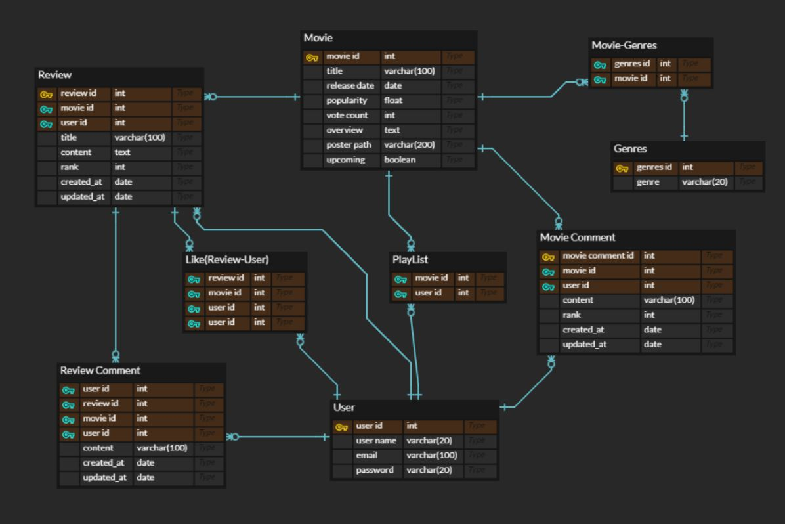


#### B. 데이터 수집

* TMDB API 사용

  ```TEXT
  네이버 API로 데이터를 수집하면 영화 줄거리를 받아올 수 없어서, 유저들에게 더 많은 정보를 제공하기 위해서 TMDB API를 활용하였다. 그리고, 받아온 DATA를 JSON파일로 수집하여 DB와 연결시켰다.
  ```

  ---> API에서 제공하는 실시간 정보를 받아오지 못한 점이 아쉬웠다. 


### 4. 필수 기능

##### A. Accounts

- 회원 가입 / 로그인 / 로그아웃

  - AUTH_User을 Custom 하여 아이디, 비밀번호, 메일을 입력 받는 식으로 회원 가입 기능을 구현하고, 로그인,  로그아웃 기능도 구현함

  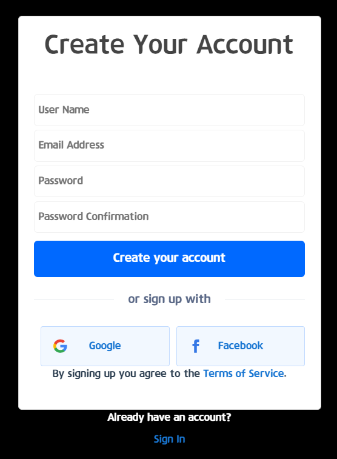

  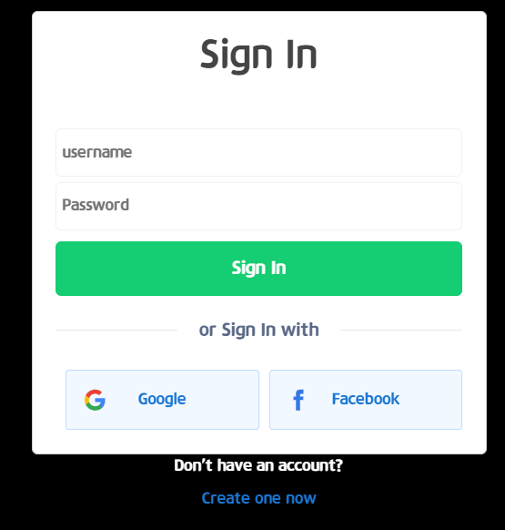

  

  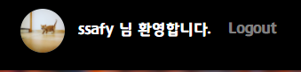

- 프로필 / 팔로우 / 팔로잉

  - 각 유저의 정보를 불러와 프로필 및 팔로우, 팔로잉 기능을 구현함

    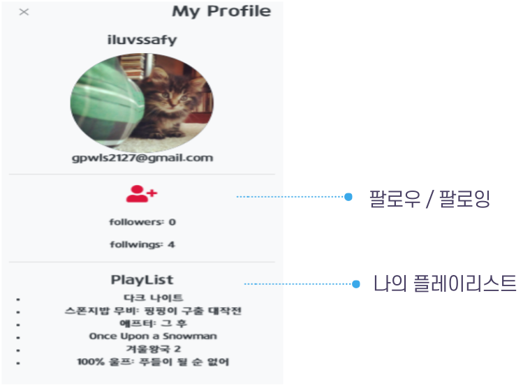  

  

- 관리자 뷰

  - Django Admin 기능을 이용하여 유저 정보 및 영화 관련 권한을 가지는 관리자 뷰 페이지를 만듬

  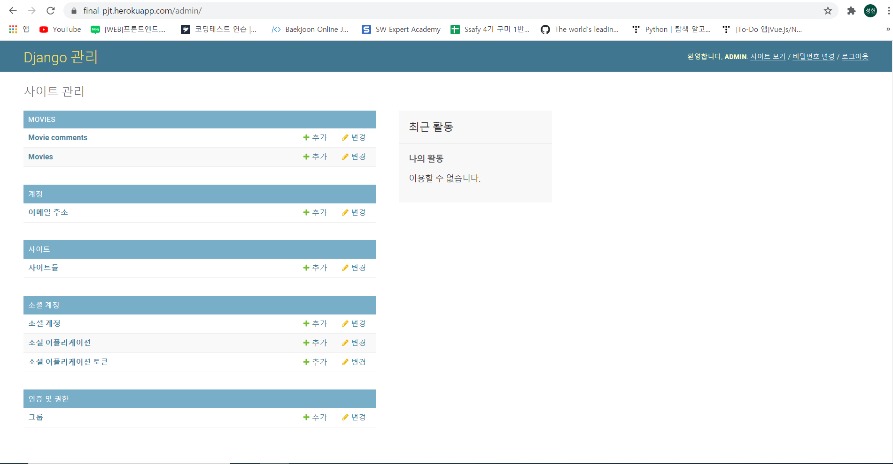

  

##### B. Home

* 영화 목록

  ```text
  - 영화 데이터 수집 : TMDB API 활용해서 json파일 만들어 DB에 적용시킴
  ```

    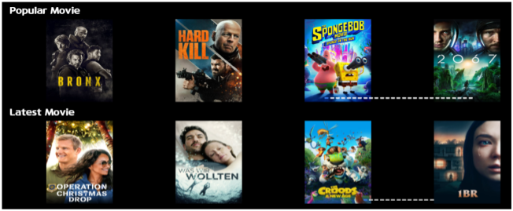  

* 영화 검색 / 필터링

  ```text
  - 필터링 기능 : 제목검색 / 장르별, ㄱㄴㄷ순, 개봉일, 인기도, 평점 / 오름차순,내림차순
  - 페이지네이션 : 보고 싶은 영화 갯수 선택 가능
  ```

* 영화 Detail 정보

  ```text
  - 제공 정보 : 영화 제목 / 평점 등록, 삭제 / 개봉일 / 장르 / 줄거리
  - 추가 기능 : 좋아요 / 플레이리스트 담기 / 댓글(한줄 감상평) / 리뷰 작성 / 리뷰 리스트
  ```

    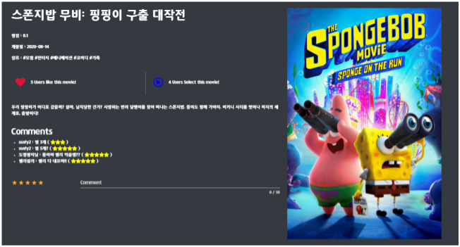  

​	

##### C. Recommend

* Follower의 영화 플레이리스트 추천

  ```text
  * 플레이리스트 구현 알고리즘
  - 프로필 page에 '나의 PlayList' 보여주기
  - 'Play List' page에 나의 플레이리스트 및 내가 팔로우하는 사람들의 플레이리스트 보여주기 
  ```

    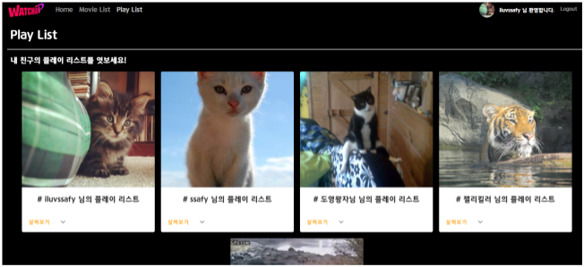 

- 영화 필터링을 통한 추천 기능

  ```
  * 영화 필터링 추천 알고리즘
  - 검색 및 장르, 제목, 평점 등에 따른 오름차순, 내림차순 결과를 필터링하여 보여줌으로써 유저가 원하는 영화에 쉽게 접근할 수 있도록 알고리즘을 구현
  ```

    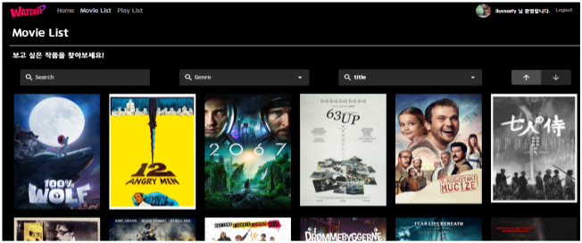  

##### D. Community

* 리뷰 작성

  ```text
  - 별점 / 작성시각 및 수정시각 / 수정 및 삭제
  ```

      

* 좋아요 및 플레이리스트 담기

  ```text
  - 자신이 좋아하는 영화에 좋아요 및 플레이리스트 추가를 누르고 좋아요 및 플레이리스트에 담은 유저들의 수를 나타냄
  ```

  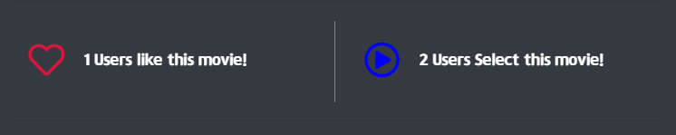

* 댓글

  ```
  Movie Comment 및 Review Comment 기능을 구현
  ```

    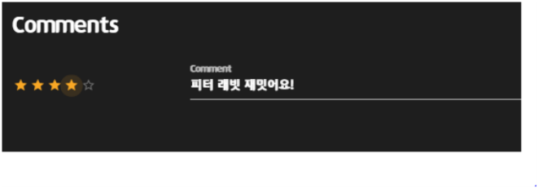  

------------

## 배포 서버 URL

* https://ssafywatchap.netlify.app


------------

## 느낀점

* 이혜진

  ```text
  웹 페이지를 직접 기획하고 구축해보면서, 사용자 입장에서 편리한 서비스가 무엇인지를 고민할 수 있게 되었습니다. 평소에는 웹페이지들이 제공해주는 서비스들을 사용하기만 했다면, 이제는 해당 사이트에서 제공하는 서비스들이 어떤 기술들을 활용하여 동작하는지를 생각해보며, 그런 기능들을 구현해보고 싶다는 생각을 가지게 되었습니다.
  ```

* 이성헌

  ```
  웹을 공부하면서 원론적인 것들만 공부를 하다가, 처음 직접적으로 웹을 기획해보면서 과연 이걸 우리가 해낼 수 있을까라는 의문이 들었습니다. 마냥 막막했지만, 모르는 것들을 찾아보고 공부하면서 차근차근 기획대로 웹페이지가 구현이 되는 과정들을 겪으며 웹개발에 대한 재미를 더욱 느낄 수 있었습니다. 이번 프로젝트에서는 한정된 시간속에서 처음 구상대로 모든 기능들을 구현하지 못했지만, 이 경험들을 잘 살려 다음 프로젝트에서는 더 수월하게 문제에 접근하여 원하는 기능들을 반드시 구현해내어야겠다는 생각이 들었습니다.
  ```

  

